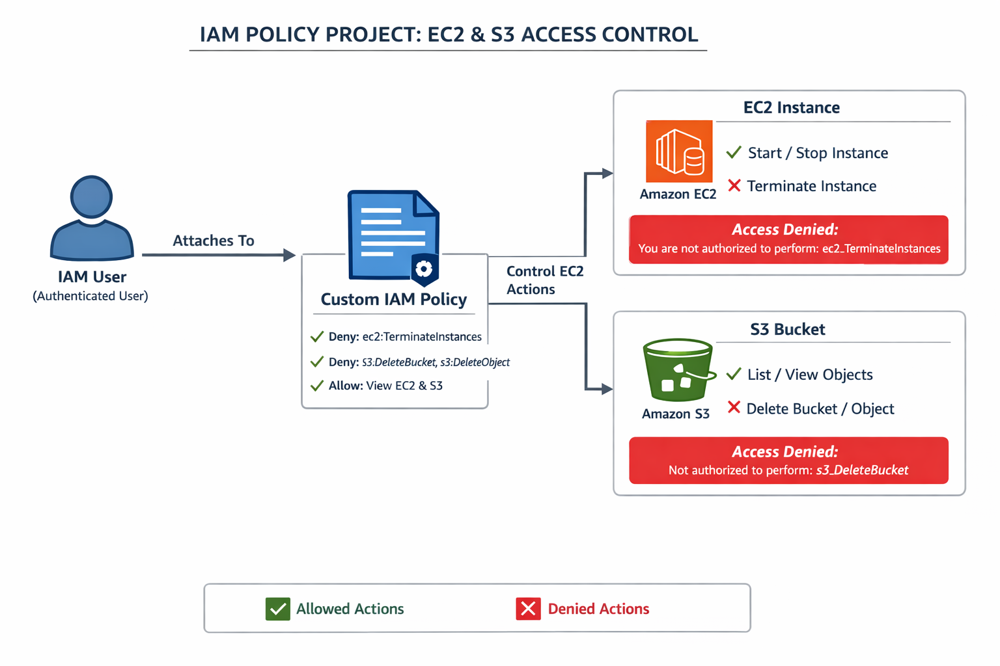

# Mini Project 8: Custom IAM Policy – Least Privilege Access Control

## 📌 Project Title

**Design and Implement a Custom IAM Policy to Control EC2 and S3 Access (Least Privilege Model)**

---

## 🎯 Project Overview

This project demonstrates how to design and implement a **custom AWS IAM policy** using the **principle of least privilege**. Instead of granting full access, permissions are carefully restricted to allow only required actions while explicitly denying destructive operations.

The project simulates a real-world enterprise security scenario where IAM users are allowed to manage resources safely without the risk of accidental deletion.

---

## 🧠 What I Learned

* IAM policy structure: `Version`, `Statement`, `Effect`, `Action`, `Resource`
* Difference between **Allow** and **Explicit Deny**
* How **Deny always overrides Allow**
* Writing service-specific IAM permissions
* Testing permissions using real AWS resources
* Implementing the **least privilege security model**

---

## 🛠️ AWS Services Used (Free Tier Safe)

| Service | Purpose                                           |
| ------- | ------------------------------------------------- |
| IAM     | Create IAM user and custom JSON policy            |
| EC2     | Test Start, Stop, and Terminate permissions       |
| S3      | Test Delete Bucket and Delete Object restrictions |

❌ No paid services used
❌ No billing risk

---

## 🧩 Project Scenario

An IAM user is created with the following access controls:

### ✅ Allowed Actions

* Start EC2 instances
* Stop EC2 instances
* Describe EC2 instances

### ❌ Denied Actions

* Terminate EC2 instances
* Delete S3 buckets
* Delete objects inside S3

This ensures the user can manage resources but **cannot destroy them**.

---

## 🪜 Implementation Steps

### Phase 1: Create Test Resources

* Launched a Free Tier EC2 instance (Amazon Linux 2)
* Created an S3 bucket for permission testing

### Phase 2: Create Custom IAM Policy

* Created a custom IAM policy using JSON
* Added Allow and Explicit Deny statements

### IAM Policy JSON

```json
{
  "Version": "2012-10-17",
  "Statement": [
    {
      "Sid": "AllowEC2StartStop",
      "Effect": "Allow",
      "Action": [
        "ec2:StartInstances",
        "ec2:StopInstances",
        "ec2:DescribeInstances"
      ],
      "Resource": "*"
    },
    {
      "Sid": "DenyEC2Terminate",
      "Effect": "Deny",
      "Action": "ec2:TerminateInstances",
      "Resource": "*"
    },
    {
      "Sid": "DenyS3Delete",
      "Effect": "Deny",
      "Action": [
        "s3:DeleteBucket",
        "s3:DeleteObject"
      ],
      "Resource": "*"
    }
  ]
}
```

### Phase 3: Attach Policy

* Attached the custom policy to the IAM user

### Phase 4: Testing & Validation

* EC2 Start/Stop → ✅ Allowed
* EC2 Terminate → ❌ AccessDenied
* S3 Delete Object → ❌ AccessDenied
* S3 Delete Bucket → ❌ AccessDenied

---

## ✅ Project Results

* Successfully created and applied a custom IAM policy
* Verified least privilege access through testing
* Prevented destructive actions using explicit deny
* Followed AWS security best practices

---

## Screenshots



---

## 🧾 Project Summary

This project showcases the implementation of AWS IAM least privilege access by allowing only essential EC2 operations while explicitly denying destructive actions across EC2 and S3. All permissions were tested and validated using real AWS resources.

---

## 🔜 Next Steps

* IAM Roles with EC2 (Role-Based Access Control)
* Implementing a 3-Tier Architecture on AWS

---

## Author
 Nithiya Bharathi
 AWS | EC2 | Hands on mini project
